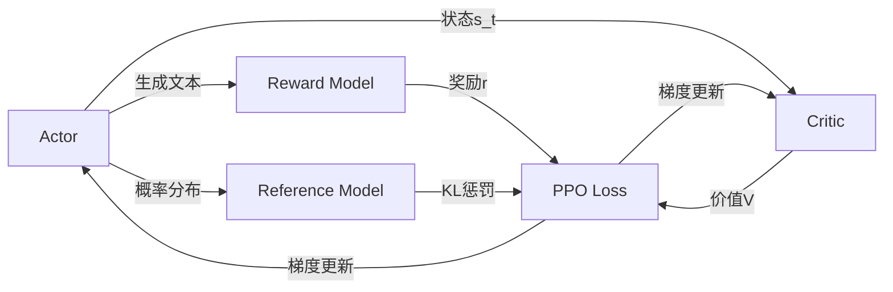

## 一、强化学习概述

### 1.1 强化学习整体流程


-   强化学习的两个实体：**智能体（Agent）**与**环境（Environment）**
-   强化学习中两个实体的交互：
    

-   **状态空间S**：S即为State，指环境中所有可能状态的集合
-   **动作空间A**：A即为Action，指智能体所有可能动作的集合
-   **奖励R：**R即为Reward，指智能体在环境的某一状态下所获得的奖励。

以上图为例，智能体与环境的交互过程如下：

-   在 $t$ 时刻，环境的状态为 $S_{t}$ ，达到这一状态所获得的奖励为 $R_{t}$
-   智能体观测到 $S_{t}$ 与 $R_{t}$ ，采取相应动作 $A_{t}$
-   智能体采取 $A_{t}$ 后，环境状态变为 $S_{t+1}$ ，得到相应的奖励 $R_{t+1}$

智能体在这个过程中学习，它的最终目标是：**找到一个策略，这个策略根据当前观测到的环境状态和奖励反馈，来选择最佳的动作。**

### 1.2 价值函数

在1.1中，我们谈到了奖励值 $R_{t}$ ，它表示环境进入状态 $S_{t}$ 下的**即时奖励**。

**但如果只考虑即时奖励，目光似乎太短浅了**：当下的状态和动作会影响到未来的状态和动作，进而影响到未来的整体收益。

所以，一种更好的设计方式是：**t时刻状态s的总收益 = 身处状态s能带来的即时收益 + 从状态s出发后能带来的未来收益。** 写成表达式就是：

$V_{t} = R_{t} + \gamma V_{t+1}$

其中：

-   $V_{t}$ ： $t$ 时刻的总收益，注意这个收益蕴涵了“即时”和“未来”的概念
-   $R_{t}$ ： $t$ 时刻的即时收益
-   $V_{t+1}$ ： $t+1$ 时刻的总收益，注意这个收益蕴涵了“即时”和“未来”的概念。而 $V_{t+1}$ 对 $V_{t}$ 来说就是“未来”。
-   $\gamma$ ：折扣因子。它决定了我们在多大程度上考虑将“未来收益”纳入“当下收益”。

注：在这里，我们不展开讨论RL中关于价值函数的一系列假设与推导，而是直接给出一个便于理解的简化结果，方便没有RL背景的朋友能倾注更多在“PPO策略具体怎么做”及“对PPO的直觉理解”上。

## 二、NLP中的强化学习

我们在第一部分介绍了通用强化学习的流程，那么我们要怎么把这个流程对应到NLP任务中呢？**换句话说，NLP任务中的智能体、环境、状态、动作等等，都是指什么呢？**


回想一下我们对NLP任务做强化学习（RLHF）的目的：**我们希望给模型一个prompt，让模型能生成符合人类喜好的response**。再回想一下gpt模型做推理的过程：**每个时刻** $t$ **只产生一个token，即token是一个一个蹦出来的，先有上一个token，再有下一个token。**

复习了这两点，现在我们可以更好解读上面这张图了：

-   我们先喂给模型一个prompt，期望它能产出符合人类喜好的response
-   在 $t$ 时刻，模型根据上文，产出一个token，**这个token即对应着强化学习中的动作，我们记为** $A_{t}$ 。因此不难理解，在NLP语境下，强化学习任务的动作空间就对应着词表。
-   在 $t$ 时刻，**模型产出token** $A_{t}$ **对应着的即时收益为** $R_{t}$  **，总收益为** $V_{t}$  **  （**复习一下， $V_{t}$ 蕴含着“即时收益”与“未来收益”两个内容）。这个收益即可以理解为“** 对人类喜好的衡量** ”。此刻，**模型的状态从** $S_{t}$ **变为** $S_{t+1}$ **，也就是从“上文”变成“上文 + 新产出的token”**
-   在NLP语境下，智能体是语言模型本身，环境则对应着它产出的语料

这样，我们就大致解释了NLP语境下的强化学习框架，不过针对上面这张图，你可能还有以下问题：

**（1）问题1：图中的下标是不是写得不太对？例如根据第一部分的介绍，** $A_{t}$ **应该对应着** $R_{t+1}$ **，** $A_{t+1}$ **应该对应着** $R_{t+2}$ **，以此类推？**

答：你说的对。但这里我们不用太纠结下标的问题，只需要记住在对应的response token位置，会产生相应的即时奖励和总收益即可。之所以用图中这样的下标，是更方便我们后续理解代码。

**（2）问题2：我知道** $A_{t}$ **肯定是由语言模型产生的，那么** $R_{t}，V_{t}$ **是怎么来的呢，也是语言模型产生的吗？**

答：先直接说结论， $A_{t}$ 是由我们的语言模型产生的， $R_{t}，V_{t}$ 则分别由另外两个模型来产生，在后文中我们会细说。

**（3）问题3：语言模型的参数在什么时候更新？是观测到一个** $R_{t}, V_{t}$ **，就更新一次参数，然后再去产生** $A_{t+1}$ **吗？**

答：当然不是。你只看到某个时刻的收益，就急着用它更新模型，这也太莽撞了。我们肯定是要等有足够的观测数据了（例如等模型把完整的response生成完），再去更新它的参数。这一点我们也放在后文细说。

**（4）问题4：再谈谈** $R_{t}, V_{t}$ **吧，在NLP的语境下我还是不太理解它们**

答：

-   首先，“收益”的含义是“对人类喜好的衡量”
-   $R_{t}$ ：即时收益，指语言模型当下产生token $A_{t}$ 带来的收益
-   $V_{t}$ ： 实际期望总收益（即时+未来），指对语言模型“当下产生token $A_{t}$ ，一直到整个response生产结束”后的期收益预估。因为当下语言模型还没产出 $A_{t}$ 后的token，所以我们只是对它之后一系列动作的收益做了估计，因而称为“期望总收益”。

本节中，我们在第二部分的基础上更进一步：更详细理清NLP语境下RLHF的运作流程。

我们从第二部分中已经知道：生成token $A_{t}$ 和对应收益 $R_{t}, V_{t}$ 的并不是一个模型。那么在RLHF中到底有几个模型？他们是怎么配合做训练的？而我们最终要的是哪个模型？




如上图，**在RLHF-PPO阶段，一共有四个主要模型**，分别是：

-   **[Actor Model](https://zhida.zhihu.com/search?content_id=238709685&content_type=Article&match_order=1&q=Actor+Model&zhida_source=entity)：演员模型**，这就是我们想要训练的目标语言模型
-   **[Critic Model](https://zhida.zhihu.com/search?content_id=238709685&content_type=Article&match_order=1&q=Critic+Model&zhida_source=entity)：评论家模型**，它的作用是预估总收益 $V_{t}$
-   **[Reward Model](https://zhida.zhihu.com/search?content_id=238709685&content_type=Article&match_order=1&q=Reward+Model&zhida_source=entity)：奖励模型**，它的作用是计算即时收益 $R_{t}$
-   **Reference Model：参考模型**，它的作用是在RLHF阶段给语言模型增加一些“约束”，防止语言模型训歪（朝不受控制的方向更新，效果可能越来越差）

其中:

-   **Actor/Critic Model**在RLHF阶段是**需要训练**的（图中给这两个模型加了粗边，就是表示这个含义）；而**Reward/Reference Model**是**参数冻结**的。
-   Critic/Reward/Reference Model共同组成了一个“奖励-loss”计算体系（我自己命名的，为了方便理解），我们综合它们的结果计算loss，用于更新Actor和Critic Model

#### **1. Actor Model (策略模型 $π_θ$)**
- **输入**：当前状态 $s_t$（文本上下文）
- **输出**：
 - 动作概率分布 $π_θ(a_t | s_t)$（下一个token的概率）
 - 实际动作 $a_t$（采样的token）
- **更新目标**：最大化修正后的奖励（含KL惩罚）
#### **2. Critic Model (价值模型 $V_φ$)**
- **输入**：状态 $s_t$（文本上下文）
- **输出**：标量价值估计 $V_φ(s_t)$（预测累积奖励）
- **更新目标**：最小化价值估计误差
#### **3. Reward Model (奖励模型 $R_ψ$)**
- **输入**：完整文本序列 $(s, a)$（如用户输入+模型回复）
- **输出**：标量奖励 $r = R_ψ(s, a)$
- **特性**：预训练后固定（不更新）
#### **4. Reference Model (参考模型 $π_{ref}$)**
- **输入**：状态 $s_t$
- **输出**：动作概率分布 $π_{ref}(a_t | s_t)$
- **作用**：计算KL散度 $KL(π_θ || π_{ref})$
- **特性**：固定（通常为初始SFT模型）

## 三 模型详细介绍
### 3.1 Actor Model (演员模型)

正如前文所说，**Actor就是我们想要训练的目标语言模型。我们一般用SFT阶段产出的SFT模型来对它做初始化。**


我们的最终目的是让Actor模型能产生符合人类喜好的response。所以我们的策略是，先喂给Actor一条prompt （这里假设batch\_size = 1，所以是1条prompt），让它生成对应的response。然后，我们再**将“prompt + response"送入我们的“奖励-loss”计算体系中去算得最后的loss，用于更新actor**。要输出动作概率分布 $π_θ(a_t | s_t)$

### 3.2 Reference Model（参考模型）

**Reference Model（以下简称Ref模型）一般也用SFT阶段得到的SFT模型做初始化，在训练过程中，它的参数是冻结的。** Ref模型的主要作用是防止Actor”训歪”，那么它具体是怎么做到这一点的呢？


“防止模型训歪”换一个更详细的解释是：**我们希望训练出来的Actor模型既能达到符合人类喜好的目的，又尽量让它和SFT模型不要差异太大**。简言之，**我们希望两个模型的输出分布尽量相似**。那什么指标能用来衡量输出分布的相似度呢？我们自然而然想到了**KL散度**。

如图所示：

-   **对Actor模型**，我们喂给它一个prompt，它正常输出对应的response。那么response中每一个token肯定有它对应的log\_prob结果呀，我们把这样的结果记为**log\_probs**
-   **对Ref模型**，我们把Actor生成的"prompt + response"喂给它，那么它同样能给出每个token的log\_prob结果，我们记其为**ref\_log\_probs**
-   那么这两个模型的输出分布相似度就可以用 **`ref_log_probs - log_probs`** 来衡量，我们可以从两个方面来理解这个公式：
	-   **从直觉上理解**，ref\_log\_probs越高，说明Ref模型对Actor模型输出的肯定性越大。即Ref模型也认为，对于某个 $S_{t}$ ，输出某个 $A_{t}$ 的概率也很高（ $P(A_{t} | S_{t})$ ）。这时可以认为Actor模型较Ref模型没有训歪
	-   **从KL散度上理解**， $KL[Actor(X) || Ref(X)] = E_{x\sim Actor(x)}[log\frac{Actor(x)}{Ref(x)}] = log\_probs - ref\_log\_probs$ （当然这里不是严格的等于，只是KL散度的近似），这个值越小意味着两个分布的相似性越高。

注：你可能已经注意到，按照KL散度的定义，这里写成`log_probs - ref_log_probs`更合适一些。但是如果你看过一些rlhf相关的论文的话，你可能记得在计算损失函数时，有一项 $R_{t} - KL散度$ （对这个有疑惑不要紧，我们马上在后文细说），即KL散度前带了负号，所以这里我写成`ref_log_probs - log_probs`这样的形式，更方便大家从直觉上理解这个公式。

现在，我们已经知道怎么利用Ref模型和KL散度来防止Actor训歪了。**KL散度将在后续被用于loss的计算**，我们在后文中会详细解释。

### 3.3 Critic Model（评论家模型）

**Critic Model用于预测期望总收益** $V_{t}$ **，和Actor模型一样，它需要做参数更新**。实践中，Critic Model的设计和初始化方式也有很多种，例如和Actor共享部分参数、从RW阶段的Reward Model初始化而来等等。我们讲解时，和deepspeed-chat的实现保持一致：从RW阶段的Reward Model初始化而来。

**你可能想问：训练Actor模型我能理解，但我还是不明白，为什么要单独训练一个Critic模型用于预测收益呢？**

这是因为，当我们在前文讨论总收益 $V_{t}$ （即时 + 未来）时，我们是站在上帝视角的，也就是这个 $V_{t}$ 就是客观存在的、真正的总收益。但是我们在训练模型时，就没有这个上帝视角加成了，**也就是在** $t$ **时刻，我们给不出客观存在的总收益** $V_{t}$ **，我们只能训练一个模型去预测它。**

**所以总结来说，在RLHF中，我们不仅要训练模型生成符合人类喜好的内容的能力（Actor），也要提升模型对人类喜好量化判断的能力（Critic）**。这就是Critic模型存在的意义。我们来看看它的大致架构：


deepspeed-chat采用了Reward模型作为它的初始化，所以这里我们也按Reward模型的架构来简单画画它。你可以简单理解成，Reward/Critic模型和Actor模型的架构是很相似的（毕竟输入都一样），同时，它在最后一层增加了一个Value Head层，该层是个简单的线形层，用于将原始输出结果映射成单一的 $V_{t}$ 值。

在图中， **$V_{t}$ 表示Critic模型对 $t$ 时刻及未来（response完成）的收益预估**。

### 3.4 Reward Model（奖励模型）(MSE训练得到)

Reward Model用于计算生成token $A_{t}$ 的即时收益，它就是RW阶段所训练的奖励模型，在RLHF过程中，它的参数是冻结的。

**你可能想问：为什么Critic模型要参与训练，而同样是和收益相关的Reward模型的参数就可以冻结呢？**

这是因为，Reward模型是站在上帝视角的。这个上帝视角有两层含义：

-   第一点，Reward模型是经过和“估算收益”相关的训练的，因此在RLHF阶段它可以直接被当作一个能产生客观值的模型。
-   第二点，Reward模型代表的含义就是“即时收益”，你的token $A_{t}$ 已经产生，因此即时收益自然可以立刻算出。

**你还可能想问：我已经用Critic预测出** $V_{t}$ **了，而这个** $V_{t}$ **包含了“即时”和“未来”的概念，那我还需要代表“即时”的** $R_{t}$ **做什么呢？直接用** $V_{t}$ **不就好了吗？**

为了解答这个问题，我们先回顾下1.2部分中给出的价值函数： $V_{t} = R_{t} + \gamma V_{t+1}$

这个函数告诉我们，我们当前可以用两个结果来表示 $t$ 时刻的总收益：

-   结果1：Critic模型预测的 $V_{t}$
-   结果2：Reward模型预测的 $R_{t}$ 和critic模型预测的 $V_{t+1}$

那么哪一个结果更靠近上帝视角给出的客观值呢？当然是结果2，因为结果1全靠预测，而结果2中的 $R_{t}$ 是事实数据。

我们知道Critic模型也是参与参数更新的，我们可以用`MSE(上帝视角的客观收益-Critic模型预测的收益)`来衡量它的loss。**但是上帝视角的客观收益我们是不知道的，只能用已知事实数据去逼近它，所以我们就用** $R_{t} + \gamma * V_{t+1}$ **来做近似。** 这就是 $R_{t}, V_{t}$ 同时存在的意义

Reward模型和critic模型非常相似，这里我们就只给出架构图，不再做过多的说明。关于Reward模型的训练过程，后续有时间也会出个原理和代码解析。


## 四、RLHF中的loss计算

到目前为止，我们已经基本了解了RLHF的训练框架，以及其中的四个重要角色（训练一个RLHF，有4个模型在硬件上跑，可想而知对存储的压力）。在本节中，我们一起来解读RLHF的loss计算方式。在解读中，我们会再一次理一遍RLHF的整体训练过程，填补相关细节。在这之后，我们就可以来看代码解析了。

在第三部分的讲解中，我们知道Actor和Critic模型都会做参数更新，所以我们的loss也分成2个：

-   **Actor loss：** 用于评估Actor是否产生了符合人类喜好的结果，将作用于Actor的BWD上。
-   **Critic loss：** 用于评估Critic是否正确预测了人类的喜好，将作用于Critic的BWD上。

我们详细来看这两者。

### 4.1 Actor loss

### （1）直观设计

我们先来看一个直观的loss设计方式：

-   Actor接收到当前上文 $S_{t}$ ，产出token $A_{t}$ （ $P(A_{t} | S_{t})$ ）
-   Critic根据 $S_{t}, A_{t}$ ，产出对总收益的预测 $V_{t}$
-   那么Actor loss可以设计为： $$actor\_loss = -{\textstyle\sum_{t \in response\_timestep}} V_{t}log P(A_{t}|S_{t})$$

求和符号表示我们只考虑response部分所有token的loss，为了表达简便，我们先把这个求和符号略去（下文也是同理），也就是说：
$$actor\_loss = -V_{t}log P(A_{t}|S_{t})$$
我们希望minimize这个actor\_loss。

**这个设计的直观解释是：**

-   当 $V_{t}>0$ 时，意味着Critic对Actor当前采取的动作给了正向反馈，因此我们就需要在训练迭代中提高 $P(A_{t} | S_{t})$ ，这样就能达到减小loss的作用。
-   当 $V_{t} < 0$ 时，意味着Critic对Actor当前采取的动作给了负向反馈，因此我们就需要在训练迭代中降低 $P(A_{t} | S_{t})$ ，这样就能到达到减小loss的作用。

**一句话总结：这个loss设计的含义是，对上文** $S_{t}$ **而言，如果token** $A_{t}$ **产生的收益较高，那就增大它出现的概率，否则降低它出现的概率。**

### （2）引入优势（Advantage）

在开始讲解之前，我们举个小例子：

假设在王者中，中路想支援发育路，这时中路有两种选择：1. 走自家野区。2. 走大龙路。

中路选择走大龙路，当她做出这个决定后，Critic告诉她可以收1个人头。结果，此刻对面打野正在自家采灵芝，对面也没有什么苟草英雄，中路一路直上，最终收割2个人头。

因为实际收割的人头比预期要多1个，中路尝到了甜头，所以她增大了“支援发育路走大龙路”的概率。

**这个多出来的“甜头”，就叫做“优势”(Advantage)。**

**对NLP任务来说，如果Critic对** $A_{t}$ **的总收益预测为** $V_{t}$ **，但实际执行** $A_{t}$ **后的总收益是** $R_{t} + \gamma * V_{t+1}$ **，我们就定义优势为：**

$$Adv_{t} = R_{t} + \gamma * V_{t+1} - V_{t}$$

我们用 $Adv_{t}$ 替换掉 $V_{t}$ ，则此刻actor\_loss变为：

$$actor\_loss = -Adv_{t}log P(A_{t}|S_{t})$$

### （3）重新设计 $R_{t}$

总结一下，到目前为止，我们的actor\_loss形式为：

$$actor\_loss = -Adv_{t}log P(A_{t}|S_{t})$$

其中， $$Adv_{t} = R_{t} + \gamma * V_{t+1} - V_{t}$$

同时注意，这个actor\_loss应该是response的所有token loss的sum或者avg。这里为了表达方便，我们的公式略去了求和或求平均的符号。

按照这个理解， $R_{t}$ 应该表示每个Actor产出token $A_{t}$ 带来的即时收益，正如下图所示（其中 $T$ 表示最后一个时刻）：


但在deepspeed-chat的RLHF实践中，对 $R_{t}$ 做了另一种设计：

$$\left\{\begin{matrix} \begin{aligned} R_{t} &= -kl\_ctl * (log\frac{P(A_{t}|S_{t})}{P_{ref}(A_{t}|S_{t})}), t\neq T\\ R_{t} &= -kl\_ctl * (log\frac{P(A_{t}|S_{t})}{P_{ref}(A_{t}|S_{t})})+ R_{t}, t=T \end{aligned} \end{matrix}\right.$$

-   $kl\_ctl$ ：常量，可以理解成是一个控制比例的缩放因子，在deepspeed-chat中默认设为0.1
-   $-log\frac{P(A_{t}|S_{t})}{P_{ref}(A_{t}|S_{t})}$ ：这一项你是不是非常眼熟，这就是我们在3.2部分介绍的Actor和Ref模型间的KL散度呀，写成更容易理解的形式，就是`ref_log_probs - log_probs`。在3.2中我们说过，为了防止模型训歪，我们需要把这个KL散度加入loss计算中，所以这里我们就在做这件事

**基于这些，上面这个对** $R_{t}$ **的设计可理解成：**

-   **当** $t \neq T$ **时，我们更加关心Actor是否有在Ref的约束下生产token** $A_{t}$
-   **当** $t =T$ **时，我们不仅关心Actor是否遵从了Ref的约束，也关心真正的即时收益** $R_{t}$

为什么只有最后一个时刻的 $R_{t}$ 被纳入了考量呢？这是因为在Reward模型训练阶段，就是用这个位置的 $R_{t}$ 来表示对完整的prompt + response的奖励预测（但不妨碍你理解成是执行完 $A_{T}$ 的即时奖励），然后用这个指标来做模型eval的（但是Reward训练阶段算loss时，还是考虑了response部分所有token输出的reward值）。所以到了RLHF的场景下，其余时刻的即时奖励，我们就用“Actor是否遵循了Ref的约束”来进行评价。

需要注意的是， $R_{t}$ 的设计并不只有这一种。deepspeed在自己的代码注释中也有提过，可以尝试把最后一个时刻的 $R_{T}$ 替换成所有token的即时奖励的平均值。如果站在这个角度理解的话，我们同样也可以尝试在每一个位置的奖励衡量上引入 $R_{t}$ 。

代码实践如下：

```python
def compute_rewards(self, prompts, log_probs, ref_log_probs, reward_score,
                        action_mask):
        """
        reward_function：计算最终的reward分数
        复习一下几个相关参数的默认值：
        self.kl_ctl = 0.1
        self.clip_reward_value = 5
        
        对于batch中的某个prompt来说，它最终的reward分数为：
        (1) 先计算actor和ref_model的logit相似度： -self.kl_ctl * (log_probs - ref_log_probs)
            其实写成self.kl_ctl * (ref_log_probs - log_probs)更好理解些
            这个值越大，说明ref_model对actor生成的结果的认可度越高（即表明rlhf没有训歪），
            没有训歪的情况下我们也应该给模型一些奖励，这个奖励就是self.kl_ctl * (ref_log_probs - log_probs)
            
        （2）由于我们只取最后一个token对应位置的分数作为reward_score，因此我们只需要：
            self.kl_ctl * (ref_log_probs - log_probs)的最后一位 + reward_score
         
         (3) 同时我们对reward_score也做了大小限制，最大不超过self.clip_reward_value（超过统一给成self.clip_reward_value），
             最小不低于-self.clip_reward_value（低于统一给成-self.clip_reward_value）
        
         (4) 最后返回的rewards大小为：（batch_size, 各条数据的长度），对batch中的每条数据来说：
             - response的最后一位：self.kl_ctl * (ref_log_probs - log_probs)的最后一位 + reward_score
             - response的其余位置：self.kl_ctl * (ref_log_probs - log_probs)
        
        """

        kl_divergence_estimate = -self.kl_ctl * (log_probs - ref_log_probs)
        rewards = kl_divergence_estimate
        # ---------------------------------------------------------------------------------------------------
        # response开始的位置
        # （因为我们对prompt做过padding处理，因此batch中每个prompt长度一致，也就意味着每个response开始的位置一致）
        # （所以这里start是不加s的，只是一个int）
        # ---------------------------------------------------------------------------------------------------
        start = prompts.shape[1] - 1
        # ---------------------------------------------------------------------------------------------------
        # response结束的位置
        # （因为一个batch中，每个response的长度不一样，所以response的结束位置也不一样）
        # （所以这里end是加s的，ends的尺寸是(batch_size,)
        # ---------------------------------------------------------------------------------------------------
        ends = start + action_mask[:, start:].sum(1) + 1
        # ---------------------------------------------------------------------------------------------------
        # 对rewards_score做限制
        # ---------------------------------------------------------------------------------------------------
        reward_clip = torch.clamp(reward_score, -self.clip_reward_value,
                                  self.clip_reward_value)
        batch_size = log_probs.shape[0]
        for j in range(batch_size):
            rewards[j, start:ends[j]][-1] += reward_clip[j] # 

        return rewards
```

### （4）重新设计优势

好，再总结一下，目前为止我们的actor\_loss为：

$$actor\_loss = -Adv_{t}log P(A_{t}|S_{t})$$

其中， $Adv_{t} = R_{t} + \gamma * V_{t+1} - V_{t}$

同时，我们对 $R_{t}$ 进行来改造，使其能够衡量Actor模型是否遵从了Ref模型的约束。

现在我们把改造焦点放在 $Adv_{t}$ 上，回想一下，既然对于收益而言，分为即时和未来，那么对于优势而言，是不是也能引入对未来优势的考量呢？这样，我们就可以把 $Adv_{t}$ 改写成如下形式：

$$Adv_{t} = (R_{t} + \gamma * V_{t+1} - V_{t}) + \gamma * \lambda * Adv_{t+1}$$

（熟悉强化学习的朋友应该能一眼看出这是GAE，这里我们不打算做复杂的介绍，一切都站在直觉的角度理解）

**其中，新引入的** $\lambda$ **也是一个常量，可将其理解为权衡因子，直觉上看它控制了在计算当前优势时对未来优势的考量。（从强化学习的角度上，它控制了优势估计的方差和偏差）**

**看到这里，你可能想问：这个代表未来优势的** $Adv_{t+1}$ **，我要怎么算呢？**

注意到，对于最后一个时刻 $t$ ，它的未来收益（ $V_{T+1}$ ）和未来优势（ $Adv_{T+1}$ ）都是0，也就是 $Adv_{T} = R_{T} - V_{T}$ ，这是可以直接算出来的。**而有了** $Adv_{T}$ **，我们不就能从后往前，通过动态规划的方法，把所有时刻的优势都依次算出来了吗？**

代码实践如下（其中返回值中的returns表示实际收益，将被用于计算Critic模型的loss，可以参见4.2，其余细节都在代码注释中）：

```python
 def get_advantages_and_returns(self, values, rewards, start):
        """
        Adopted from https://github.com/CarperAI/trlx/blob/main/trlx/models/modeling_ppo.py#L134
        
        没有引入GAE前的t时刻的优势值：
        detal_t = r_t + gamma * V_t+1 - V_t
        其中：
            - r_t表示t时刻的即时收益
            - V_t+1表示未来时刻的预期收益
            - r_t + gamma * V_t+1可理解成t时刻的实际预期收益
            - V_t可理解成t时刻的预估预期收益（是模型，例如critic model自己估算出来的）
        
        引入GAE后的t时刻的优势值：
        A_t = delta_t + gamma * lambda * A_t+1
        粗暴理解为在t时刻时，不仅考虑当下优势，还考虑了未来的优势
        为了知道A_t, 我们得知道A_t+1，所以在本算法中采取了从后往前做动态规划求解的方法，也即：
        假设T是最后一个时刻，则有A_T+1 = 0, 所以有: A_T = delta_T
        知道了A_T, 就可以依次往前倒推，把A_t-1, A_t-2之类都算出来了
        
        引入GAE后t时刻的实际预期收益
        returns_t = A_t + V_t
                  = delta_t + gamma * lambda * A_t+1 + V_t
                  = r_t + gamma * V_t+1 - V_t + gamma * lambda * A_t+1 + V_t
                  = r_t + gamma * (V_t+1 + lambda * A_t+1)
        
        注意，这里不管是advantages还是returns，都只算response的部分
        """
        
        # Adopted from https://github.com/CarperAI/trlx/blob/main/trlx/models/modeling_ppo.py#L134
        lastgaelam = 0
        advantages_reversed = []
        length = rewards.size()[-1]
        # 注意这里用了reversed，是采取从后往前倒推计算的方式
        for t in reversed(range(start, length)):
            nextvalues = values[:, t + 1] if t < length - 1 else 0.0
            delta = rewards[:, t] + self.gamma * nextvalues - values[:, t]
            lastgaelam = delta + self.gamma * self.lam * lastgaelam
            advantages_reversed.append(lastgaelam)
        advantages = torch.stack(advantages_reversed[::-1], dim=1) # 优势
        returns = advantages + values[:, start:] # 实际收益
        # values: 预期收益
        return advantages.detach(), returns
```

### （5）PPO-epoch: 引入新约束

总结一下，目前为止我们的actor\_loss为：

$$actor\_loss = -Adv_{t}log P(A_{t}|S_{t})$$

其中， $$Adv_{t} = (R_{t} + \gamma * V_{t+1} - V_{t}) + \gamma * \lambda * Adv_{t+1}$$

同时

-   **我们已经对** $R_{t}$ **进行来改造，使其能够衡量Actor模型是否遵从了Ref模型的约束。**
-   **我们已经对** $Adv_{t}$ **进行改造，使其不仅考虑了当前时刻的优势，还考虑了未来的优势**
*   $γ$：折扣因子（Discount Factor，通常接近1，如0.99）。
* $λ$：权衡偏差与方差的参数（0 ≤ λ ≤ 1）。$λ=0$ 时 $A_t = δ_t$（高偏差低方差）；$λ=1$ 时 $A_t$ 接近蒙特卡洛估计（低偏差高方差）。通常取 $λ=0.95$ 左右。

基于这些改造，我们重新理一遍RLHF-PPO的训练过程。


-   第一步，我们准备一个batch的prompts
-   第二步，我们将这个batch的prompts喂给Actor模型，让它生成对应的responses
-   第三步，我们把prompt+responses喂给我们的Critic/Reward/Reference模型，让它生成用于计算actor/critic loss的数据，按照强化学习的术语，我们称这些数据为经验（experiences）。critic loss我们将在后文做详细讲解，目前我们只把目光聚焦到actor loss上
-   第四步，我们根据这些经验，实际计算出actor/critic loss，然后更新Actor和Critic模型

这些步骤都很符合直觉，但是细心的你肯定发现了，**文字描述中的第四步和图例中的第四步有差异：图中说，这一个batch的经验值将被用于n次模型更新，这是什么意思呢？**

我们知道，**在强化学习中，收集一个batch的经验是非常耗时的。对应到我们RLHF的例子中，收集一次经验，它要等四个模型做完推理才可以**，正是因此，一个batch的经验，只用于计算1次loss，更新1次Actor和Critic模型，好像有点太浪费了。

所以，**我们自然而然想到，1个batch的经验，能不能用来计算ppo-epochs次loss，更新ppo-epochs次Actor和Critic模型？** 简单写一下伪代码，我们想要：

```python
# --------------------------------------------------------------
# 初始化RLHF中的四个模型
# --------------------------------------------------------------
actor, critic, reward, ref = initialize_models()

# --------------------------------------------------------------
# 训练
# --------------------------------------------------------------
# 对于每一个batch的数据
for i in steps: 
    # 先收集经验值
    exps = generate_experience(prompts, actor, critic, reward, ref)
    # 一个batch的经验值将被用于计算ppo_epochs次loss，更新ppo_epochs次模型
    # 这也意味着，当你计算一次新loss时，你用的是更新后的模型
    for j in ppo_epochs:
        actor_loss = cal_actor_loss(exps, actor)
        critic_loss = cal_critic_loss(exps, critic)
        
        actor.backward(actor_loss)
        actor.step()
        
        critc.backward(critic_loss)
        critic.step()
```

**而如果我们想让一个batch的经验值被重复使用ppo\_epochs次，等价于我们想要Actor在这个过程中，模拟和环境交互ppo\_epochs次。** 举个例子：

-   如果1个batch的经验值只使用1次，那么在本次更新完后，Actor就吃新的batch，正常和环境交互，产出新的经验值
-   但如果1个batch的经验值被使用ppo\_epochs次，在这ppo\_epochs中，Actor是不吃任何新数据，不做任何交互的，所以我们只能让Actor“模拟”一下和环境交互的过程，吐出一些新数据出来。

那怎么让Actor模拟呢？很简单，让它观察一下之前的数据长什么样，让它依葫芦画瓢，不就行了吗？**我们假设最开始吃batch，吐出经验的actor叫** $Actor_{old}$ **，而在伪代码中，每次做完ppo\_epochs而更新的actor叫** $Actor_{new}$ **，那么我们只要尽量保证每次更新后的** $Actor_{new}$ **能模仿最开始的那个** $Actor_{old}$ **，不就行了吗？**

诶！是不是很眼熟！两个分布，通过什么方法让它们相近！**那当然是KL散度**！所以，再回到我们的actor\_loss上来，它现在就可被改进成：

$$actor\_loss = -Adv_{t}log \frac{P(A_{t}|S_{t})}{P_{old}(A_{t}|S_{t})}$$

我们再稍作一些改动将log去掉（这个其实不是“稍作改动去掉log”的事，是涉及到PPO中重要性采样的相关内容，大家有兴趣可以参考[这篇](https://link.zhihu.com/?target=https%3A//www.cnblogs.com/xingzheai/p/15931681.html)）：

$$actor\_loss = -Adv_{t} * \frac{P(A_{t}|S_{t})}{P_{old}(A_{t}|S_{t})}$$

其中， $P_{old}$ 表示真正吃了batch，产出经验值的Actor；P表示ppo\_epochs中实时迭代更新的Actor，它在模仿 $P_{old}$ 的行为。**所以这个公式从直觉上也可以理解成：在Actor想通过模拟交互的方式，使用一个batch的经验值更新自己时，它需要收到真正吃到batch的那个时刻的Actor的约束，这样才能在有效利用batch，提升训练速度的基础上，保持训练的稳定。**

但是，谨慎的你可能此时又有新的担心了：**虽然我们在更新Actor的过程中用** $Actor_{old}$ **做了约束，但如果** $Actor_{old}$ **的约束能力不够，比如说** $\frac{P(A_{t} | S_{t})}{P_{old}(A_{t} | S_{t})}$ **还是超出了可接受的范围，那怎么办？**

很简单，那就**剪裁（clip）** 它吧！

我们给 $\frac{P(A_{t} | S_{t})}{P_{old}(A_{t} | S_{t})}$ 设置一个范围，例如`(0.8 ,1.2)`，也就是如果这个值一旦超过1.2，那就统一变成1.2；一旦小于0.8，那就统一变成0.8。这样就能保证 $Actor$ 和 $Actor_{old}$ 的分布相似性在我们的掌控之内了。此时actor\_loss变为：

$actor\_loss = -min(Adv_{t} *\frac{P(A_{t} | S_{t})}{P_{old}(A_{t} | S_{t})},  Adv_{t} * clip(\frac{P(A_{t} | S_{t})}{P_{old}(A_{t} | S_{t})}, 0.8, 1.2))$

这时要注意，如果超过变化范围，将 $\frac{P(A_{t} | S_{t})}{P_{old}(A_{t} | S_{t})}$ 强制设定为一个常数后，就说明这一部分的loss和Actor模型无关了，而 $Adv_{t}$ 这项本身也与Actor无关。**所以相当于，在超过约束范围时，我们停止对Actor模型进行更新。**

整体代码如下：

```python
    def actor_loss_fn(self, logprobs, old_logprobs, advantages, mask):
        """
        logprobs: 实时计算的，response部分的prob（只有这个是随着actor实时更新而改变的）
        old_logprobs：老策略中，response部分的prob （这个是固定的，不随actor实时更新而改变）
        advantages： 老策略中，response部分每个token对应的优势（这个是固定的，不随actor实时更新而改变）
        mask：老策略中，response部分对应的mask情况这个是固定的，不随actor实时更新而改变）
        
        之所以要引入logprobs计算actor_loss，是因为我们不希望策略每次更新的幅度太大，防止模型训歪
        
        self.cliprange: 默认值是0.2
        """
        ## policy gradient loss
        # -------------------------------------------------------------------------------------
        # 计算新旧策略间的KL散度
        # -------------------------------------------------------------------------------------
        log_ratio = (logprobs - old_logprobs) * mask
        ratio = torch.exp(log_ratio)
        # -------------------------------------------------------------------------------------
        # 计算原始loss和截断loss
        # -------------------------------------------------------------------------------------
        pg_loss1 = -advantages * ratio
        pg_loss2 = -advantages * torch.clamp(ratio, 1.0 - self.cliprange, 1.0 + self.cliprange)
        pg_loss = torch.sum(torch.max(pg_loss1, pg_loss2) * mask) / mask.sum() # 最后是取每个非mask的response token的平均loss作为最终loss
        return pg_loss
```

### （6）Actor loss小结

（1）～（5）中我们一步步树立了actor\_loss的改进过程，这里我们就做一个总结吧：

$$actor\_loss = -min(Adv_{t} *\frac{P(A_{t} | S_{t})}{P_{old}(A_{t} | S_{t})},  Adv_{t} * clip(\frac{P(A_{t} | S_{t})}{P_{old}(A_{t} | S_{t})}, 0.8, 1.2)$$

其中：

-   $Adv_{t} = (R_{t} + \gamma * V_{t+1} - V_{t}) + \gamma * \lambda * Adv_{t+1}$
-   **我们已经对** $R_{t}$ **进行来改造，使其能够衡量Actor模型是否遵从了Ref模型的约束**
-   **我们已经对** $Adv_{t}$ **进行改造，使其不仅考虑了当前时刻的优势，还考虑了未来的优势**
-   **我们重复利用了1个batch的数据，使本来只能被用来做1次模型更新的它现在能被用来做ppo\_epochs次模型更新。我们使用真正吃了batch，产出经验值的那个时刻的Actor分布来约束ppo\_epochs中更新的Actor分布**
-   **我们考虑了剪裁机制（clip），在ppo\_epochs次更新中，一旦Actor的更新幅度超过我们的控制范围，则不对它进行参数更新。**

### 4.2 Critic loss

我们知道，1个batch产出的经验值，不仅被用来更新Actor，还被用来更新Critic。对于Critic loss，我们不再像Actor loss一样给出一个“演变过程”的解读，我们直接来看它最后的设计。

首先，在之前的解说中，你可能有这样一个印象：

-   $V_{t}$ ：Critic对t时刻的总收益的预估，这个总收益包含即时和未来的概念（预估收益）
-   $R_{t} + \gamma * V_{t+1}$ ：Reward计算出的即时收益 $R_{t}$ ，Critic预测出的 $t+1$ 及之后时候的收益的折现，这是比 $V_{t}$ 更接近t时刻真值总收益的一个值（实际收益）

所以，我们的第一想法是：

$$Critic\_loss = (R_{t} + \gamma * V_{t+1} - V_{t})^{2}$$

现在，我们对“实际收益”和“预估收益”都做一些优化。

### （1）实际收益优化

我们原始的实际收益为 $R_{t} + \gamma * V_{t+1}$ ，但是当我们在actor\_loss中引入“优势”的概念时，“优势”中刻画了更为丰富的实时收益信息，所以，我们将实际收益优化为： $Adv_{t} + V_{t}$

### （2）预估收益优化

我们原始的预估收益为 $V_{t}$ 。

类比于Actor，Critic模型在ppo\_epochs的过程中也是不断更新的。所以这个 $V_{t}$ 可以理解成是 $Critic_{old}$ ，也就是真正吃了batch，参与产出经验的那个时候的Critic产出的收益预测结果。

我们同样想用旧模型去约束新模型，但对于Critic我们采用的约束策略就比较简单了，我们直接看代码，从中可以看出，我们用老 $V_{t}$ 设计了了一个变动范围，然后用这个变动范围去约束新 $V_{t}$

```python3
# self.cliprange_value是一个常量
# old_values: 老critic的预测结果
# values：新critic的预测结果
values_clipped = torch.clamp(
            values,
            old_values - self.cliprange_value,
            old_values + self.cliprange_value,
        )
```

那么最终我们就取实际收益和预估收益的MSE做为loss就好，这里注意，计算实际收益时 $Adv_{t}, V_{t}$ 都是老Critic（真正吃了batch的那个）产出的结果，而预估收益是随着ppo\_epochs而变动的。

代码如下：

```python3
def critic_loss_fn(self, values, old_values, returns, mask):
        """
        values: 实时critic跑出来的预估预期收益（是变动的，随着ppo epoch迭代而改变）
        old_values：老critic跑出来的预估预期收益（是固定值）
        returns：实际预期收益
        mask：response部分的mask
        
        self.cliprange_value = 0.2
        """
        ## value loss
        # 用旧的value去约束新的value
        values_clipped = torch.clamp(
            values,
            old_values - self.cliprange_value,
            old_values + self.cliprange_value,
        )
        if self.compute_fp32_loss:
            values = values.float()
            values_clipped = values_clipped.float()
        
        # critic模型的loss定义为（预估预期收益-实际预期收益）**2
        vf_loss1 = (values - returns)**2
        vf_loss2 = (values_clipped - returns)**2
        vf_loss = 0.5 * torch.sum(
            torch.max(vf_loss1, vf_loss2) * mask) / mask.sum() # 同样，最后也是把critic loss平均到每个token上
        return vf_loss
```

## 五、QA
**PPO 在 LLM RLHF 中的特殊考虑：**
1.  **稀疏奖励：** 奖励模型 $R_ψ$ 通常只在*完整序列*结束时给出一个奖励 $R$。这导致每个时间步 $t$ 的即时奖励 $r_t$ 非常稀疏（大部分为0）。GAE 在这里至关重要，它能有效地将这个稀疏的最终奖励 $R$ 合理地**分配（Credit Assignment）** 给序列中的各个生成步骤（Token）。
2.  **KL 散度约束：**
   *   在 RLHF 中，防止策略 $π_θ$ 过度偏离原始的 SFT 模型 $π_{SFT}$ 非常重要。过度偏离可能导致生成内容不可控、无意义或忘记基础能力。
   *   原始的 PPO-Clip 通过 $π_{θ_\text{old}}$ 约束了*本轮更新内*的策略偏移。为了更严格地约束偏离 SFT 模型，通常在总损失中**额外添加一个 KL 散度惩罚项**：
       $$
       L^{KL}(θ) = β * E_t [ KL(π_θ(·|s_t) || π_{SFT}(·|s_t)) ]
       $$
       其中 $β$ 是 KL 惩罚系数。这会被加到 $L^{TOTAL}$ 中。
   *   有些实现会动态调整 $β$ 以维持一个期望的平均 KL 散度。
3.  **Value Function 初始化：** Critic $V_φ$ 通常从 SFT 模型初始化，或者共享其底层的 Transformer 层。
4.  **分布式训练：** 由于 LLM 和 PPO 的计算开销巨大，实际训练需要大规模分布式系统（多节点、多 GPU）并行进行数据收集（多个 $π_{θ_\text{old}}$ 实例同时生成）和模型更新。
**可能深入的问题 (Be Prepared!):**
5.  **PPO vs. TRPO：** TRPO 使用复杂的二阶方法（共轭梯度+线搜索）来强制满足严格的 KL 约束。PPO 使用一阶优化和简单的 Clip 机制来近似实现类似效果，计算效率更高，更易于实现和调参，效果相当或更好。
6.  **为什么 Clip 有效？** 它通过限制重要性采样比率 $r_t(θ)$ 的变化范围，隐式地约束了策略更新的步长，防止新策略偏离旧策略太远，从而提高了训练的稳定性。它是对策略空间的一种保守更新策略。
7.  **GAE(λ) 中 λ 的作用？** $λ$ 控制偏差-方差的权衡。$λ=1$ 时 $A_t$ 基于整个轨迹的蒙特卡洛估计（无偏差但高方差）。$λ=0$ 时 $A_t = δ_t$ 仅基于相邻一步的 TD 估计（高偏差但低方差）。$λ≈0.95$ 是一个常用折中。
8.  **熵奖励的作用？** 防止策略过早地变得过于确定（“峰值化”），鼓励探索不同的动作（词），有助于发现更好的策略并提高鲁棒性。这在LLM中对于保持生成多样性很重要。
9.  **KL 散度惩罚为什么重要？** 防止 RL 微调后的模型过度优化奖励模型（可能导致“胡说八道”或对抗性利用奖励模型弱点），并保留基础语言能力。确保模型输出在提升符合人类偏好的同时，仍然保持合理性和一致性。
10.  **PPO 的超参数有哪些？如何调？**
   *   关键超参：$ε$ (Clip Range), $γ$ (Discount Factor), $λ$ (for GAE), $c1$ (VF coeff), $c2$ (Entropy coeff), $β$ (KL coeff), Learning Rate, Batch Size, Minibatch Size, $K$ (Epochs), $N$ (更新次数后同步旧策略)。
   *   调参经验：通常基于文献和代码库的默认值开始（如 $ε=0.2, γ=0.99, λ=0.95, c1=1, c2=0.01$）。学习率和 $β$ 需要仔细调整。监控关键指标：平均奖励、KL散度（相对SFT）、训练损失（Policy Loss, VF Loss）、熵。可能需要网格搜索或贝叶斯优化。
7.  **PPO 的局限性？**
   *   对超参数（尤其是 $ε$ 和 $β$）敏感。
   *   仍然需要相对较多的交互数据。
   *   Clip 机制有时可能过于保守，限制学习速度。
   *   实现相对复杂（需维护4个模型/快照，GAE计算）。
   *   奖励模型 $R_ψ$ 的质量是瓶颈（Garbage in, Garbage out）。
**总结：**
PPO 通过引入**重要性采样比率裁剪（Clipping）** 机制，在保证训练**稳定性**的前提下，实现了比传统 PG 更高的**样本效率**。它采用 **Actor-Critic** 架构，利用 **Critic ($V_φ$)** 估计优势函数 **$A_t$** (常用 **GAE** 计算) 来降低策略梯度的方差。**参考模型 ($π_{θ_\text{old}}$)** 定义了策略更新的信任域。在 LLM RLHF 中，**奖励模型 ($R_ψ$)** 提供符合人类偏好的稀疏奖励信号。PPO 的核心损失 $L^{CLIP}(θ)$ 巧妙地结合了策略梯度目标和 Clip 约束。价值损失 $L^{VF}(φ)$ 和熵奖励 $L^{ENT}(θ)$ 进一步完善了优化目标。额外的 **KL 散度惩罚**对于约束 LLM 策略不偏离 SFT 基础模型至关重要。

**核心理解：PPO 是什么？为什么需要它？**
1.  **问题背景 (Policy Gradient 的缺陷)：** 在强化学习（RL）中，我们训练一个智能体（Agent，这里指语言模型）通过与环境交互（Environment，这里指用户输入和期望的输出）来学习最优策略（Policy，即给定输入下生成输出的概率分布）。经典的策略梯度（Policy Gradient, PG）方法直接优化策略以最大化期望累积奖励（Expected Return）。然而，PG 存在两个主要问题：
   *   **样本效率低：** 需要大量新样本（即模型与环境交互产生的新数据）才能更新一次策略。
   *   **训练不稳定：** 策略更新步长过大时，可能导致策略性能急剧下降（性能崩溃），且难以恢复。这是因为策略的微小变化可能导致采样到的动作分布发生巨大偏移，进而使基于旧策略样本计算的梯度估计失效（**重要性采样比率爆炸**）。
2.  **PPO 的核心思想：** 解决 PG 的不稳定性问题。其核心在于**限制策略更新的幅度**，确保新策略 $π_θ$ 不会偏离生成当前训练数据的旧策略 $π_{θ_\text{old}}$ 太远。
   *   **"Proximal" (近端) 的含义：** 就是指这种约束，让更新后的策略保持在旧策略附近的一个信任域（Trust Region）内。
   *   **目标：** 在保证训练稳定性的前提下，尽可能高效地利用样本进行策略改进。
3.  **PPO 的优势 (为什么在 LLM RLHF 中占主导地位)：**
   *   **稳定性：** 显著降低了策略性能崩溃的风险。
   *   **样本效率：** 比 TRPO（Trust Region Policy Optimization，PPO的前身）实现更简单，计算效率更高，允许使用同一个批次的样本进行多次小批量（Minibatch）更新（即$K$个epochs和$M$个minibatches）。
   *   **易于实现与调参：** 相比 TRPO 复杂的二阶优化和约束处理，PPO 使用一阶优化（如Adam）和裁剪（Clipping）机制，更易于实现和集成到现有深度学习框架中。
   *   **效果优异：** 在实践中被证明是训练复杂策略（如LLMs）非常有效的算法。
**PPO 架构详解：流程、模型与 Loss**
**核心流程 (PPO-Clip 算法)：**
PPO 是一个**基于 Actor-Critic 架构**的**策略优化**算法。它主要包含四个模型（参数化函数），通常共享一个主干网络（Backbone），但在功能上区分清晰：
1.  **策略模型 (Actor / Policy Network - $π_θ$)：**
   *   **角色：** 这是我们要优化的**主模型**。在LLM中，这就是被RLHF微调的语言模型本身。
   *   **输入：** 当前状态 $s_t$（在LLM中通常是对话历史或提示 $prompt$ + 已生成的部分 $response$）。
   *   **输出：** 动作 $a_t$ 的概率分布 $π_θ(a_t | s_t)$（在LLM中，$a_t$ 是在词汇表 $V$ 中选择下一个词 $w_t$ 的动作，即 $P(w_t | prompt, w_0, ..., w_{t-1})$）。
   *   **目的：** 学习生成能获得高奖励（符合人类偏好）的回应。
2.  **价值模型 (Critic / Value Network - $V_φ$)：**
   *   **角色：** 评估给定状态 $s_t$ 的**预期累积奖励（状态值函数）**。
   *   **输入：** 状态 $s_t$（同Policy）。
   *   **输出：** 一个标量值 $V_φ(s_t)$，表示从状态 $s_t$ 开始，遵循当前策略 $π_θ$ 所能获得的期望累积折扣奖励 $E_π[Σ γ^k r_{t+k} | s_t]$。
   *   **目的：** 为 Actor 提供更准确的梯度信号（通过计算优势函数 $A_t$），减少策略梯度的方差，加速学习。
3.  **参考模型 (Reference Model / Old Policy - $π_{θ_\text{old}}$)：**
   *   **角色：** 这是策略模型 $π_θ$ **在收集当前批次数据时的快照（Snapshot）**。在整个批次数据收集期间和后续的多个 minibatch 更新过程中，它的参数 ${θ_\text{old}}$ 是**冻结（Fixed）** 的。
   *   **输入/输出：** 同策略模型 $π_θ$。
   *   **关键作用：**
       *   计算**重要性采样比率（Importance Sampling Ratio）** $r_t(θ) = π_θ(a_t | s_t) / π_{θ_\text{old}}(a_t | s_t)$。这个比率衡量了新策略 $π_θ$ 相对于旧策略 $π_{θ_\text{old}}$ 选择动作 $a_t$ 的倾向变化程度。
       *   **约束更新：** PPO 的核心机制（Clipping）就是通过限制这个比率 $r_t(θ)$ 的变化范围，来防止新策略偏离旧策略太远。它定义了策略更新的“信任域”。
   *   **更新：** 在完成一个批次数据的多次（$K$个epochs）小批量更新后，将当前策略模型 $π_θ$ 的参数复制给参考模型 $π_{θ_\text{old}}$ (${θ_\text{old}} ← θ$)，然后开始收集下一批新数据。
4.  **奖励模型 (Reward Model - $R_ψ$)** (在 RLHF 流程中预训练好，通常在 PPO 训练期间**冻结**)：
   *   **角色：** 学习并**模拟人类的偏好**。它是在 RLHF 的监督微调（SFT）阶段之后，通过人类对模型生成结果（通常是成对比较 $(y_w, y_l)$，$y_w$ 胜于 $y_l$) 的标注数据训练得到的。
   *   **输入：** 一个完整的序列（$prompt + response$）。
   *   **输出：** 一个标量奖励值 $R_ψ(prompt, response)$。这个值越高，表示模型生成的 $response$ 越符合人类的偏好（如：有帮助、诚实、无害）。
   *   **目的：** 在 PPO 训练过程中，为生成的完整 $response$ 提供**奖励信号 $r$**。这个 $r$ 是计算轨迹（Trajectory）中每一步回报（Return） $G_t$ 和优势函数 $A_t$ 的最终来源。
   *   **关键点：** 在标准的 PPO 循环中，$R_ψ$ 是**预先训练好并在 PPO 训练期间保持冻结**的。PPO 优化的是策略 $π_θ$ 和价值函数 $V_φ$，使策略生成的回应能获得 $R_ψ$ 给出的高奖励。


#传统策略梯度：

目标变为：
$$\begin{equation}
Loss =-\frac{1}{N} \sum_{n=1}^N \sum_{t=1}^{T_n} R\left(\tau^n\right) \nabla\log P_\theta\left(a_n^t \mid s_n^t\right)
\end{equation}$$
其中
$$\begin{equation}
\textbf{$R\left(\tau^n\right) \rightarrow \sum_{t^{\prime}=t}^{T_n} \gamma^{t^{\prime}-t} r_{t^{\prime}}^n=R_t^n$}
\end{equation}$$
因此
$$\begin{equation}
Loss =-\frac{1}{N} \sum_{n=1}^N \sum_{t=1}^{T_n} R_t^n \nabla\log P_\theta\left(a_n^t \mid s_n^t\right) =-\frac{1}{N} \sum_{n=1}^N \sum_{t=1}^{T_n} (R_t^n - B(s_n^t)) \nabla\log P_\theta\left(a_n^t \mid s_n^t\right)
\end{equation}$$
做出一个动作的reward：（优势函数计算）
$$A_\theta(s, a)=Q_\theta(s, a)-V_\theta(s)$$
有
$$ Q_\theta\left(s_t, a\right)=r_t+\gamma * V_\theta\left(s_{t+1}\right)
$$
Loss函数可以是
$$\begin{equation}
Loss =-\frac{1}{N} \sum_{n=1}^N \sum_{t=1}^{T_n} A_\theta(s, a) \log P_\theta\left(a_n^t \mid s_n^t\right)
\end{equation}$$
因此
$$\begin{aligned}
& A_\theta\left(s_t, a\right)=r_t+\gamma * V_\theta\left(s_{t+1}\right)-V_\theta\left(s_t\right) \\
\end{aligned}
$$
也可以写成（Critic网络给出Value）
$$ V_\theta\left(s_{t+1}\right) \approx r_{t+1}+\gamma * V_\theta\left(s_{t+2}\right)$$
对$A_\theta\left(s_t, a\right)$进行采样，采样越多，精度越高：
$$\begin{aligned}
& A_\theta^1\left(s_t, a\right)=r_t+\gamma * V_\theta\left(s_{t+1}\right)-V_\theta\left(s_t\right) \\
& A_\theta^2\left(s_t, a\right)=r_t+\gamma * r_{t+1}+\gamma^2 * V_\theta\left(s_{t+2}\right)-V_\theta\left(s_t\right) \\
& A_\theta^3\left(s_t, a\right)=r_t+\gamma * r_{t+1}+\gamma^2 * r_{t+2}+\gamma^3 V_\theta\left(s_{t+3}\right)-V_\theta\left(s_t\right) \\
& A_\theta^T\left(s_t, a\right)=r_t+\gamma * r_{t+1}+\gamma^2 * r_{t+2}+\gamma^3 V_\theta\left(s_{t+3}\right) + ... + \gamma^T V_\theta\left(s_{T}\right) -V_\theta\left(s_t\right)
\end{aligned}$$
定义：
$$\begin{aligned}
& \delta_t^V=r_t+\gamma * V_\theta\left(s_{t+1}\right)-V_\theta\left(s_t\right) \\
& \delta_{t+1}^V=r_{t+1}+\gamma * V_\theta\left(s_{t+2}\right)-V_\theta\left(s_{t+1}\right) \\
\end{aligned}
$$
则：
$$ \begin{aligned}
& A_\theta^{1} \left(s_t, a\right)=\delta_t^{V}\\
& A_\theta^2\left(s_t, a\right)=\delta_t^V+\gamma \delta_{t+1}^{V}\\
& A_\theta^3\left(s_t, a\right)=\delta_t^V+\gamma \delta_{t+1}^V+\gamma^2 \delta_{t+2}^V
\end{aligned}
$$
怎么进行采用呢？可以设计如下：
$$
\begin{aligned}
A_\theta^{G A E}\left(s_t, a\right)&=(1-\lambda)\left(A_\theta^1+\lambda * A_\theta^2+\lambda^2 A_\theta^3+\cdots\right)\\
& =(1-\lambda)\left(\delta_t^V+\lambda *\left(\delta_t^V+\gamma \delta_{t+1}^V\right)+\lambda^2\left(\delta_t^V+\gamma \delta_{t+1}^V+\gamma^2 \delta_{t+2}^V\right)+\cdots\right) \\
& =(1-\lambda)\left(\delta_t^V\left(1+\lambda+\lambda^2+\cdots\right)+\gamma \delta_{t+1}^V *\left(\lambda+\lambda^2+\cdots\right)+\cdots\right) \\
& =(1-\lambda)\left(\delta_t^V \frac{1}{1-\lambda}+\gamma \delta_{t+1}^V \frac{\lambda}{1-\lambda}+\cdots\right) \\
& =\sum_{b=0}^{\infty}(\gamma \lambda)^b \delta_{t+b}^V
\end{aligned}
$$
所以，Loss可以是
$$
Loss =-\frac{1}{N} \sum_{n=1}^N \sum_{t=1}^{T_n} A_\theta^{G A E}\left(s_n^t, a_n^t\right) \log P_\theta\left(a_n^t \mid s_n^t\right)=-\frac{1}{N} \sum_{n=1}^N \sum_{t=1}^{T_n}\sum_{b=0}^{\infty}(\gamma \lambda)^b \delta_{t+b}^{V}\log P_\theta\left(a_n^t \mid s_n^t\right)
$$
其中$\delta_t^V=r_t+\gamma * V_\theta\left(s_{t+1}\right)-V_\theta\left(s_t\right)$，用神经网络拟合

---
根据重要性采样
$$
\begin{aligned}
& \mathrm{E}(f(x))_{x \sim p(x)}=\sum_x f(x) * p(x) \\
&=\sum_x f(x) * p(x) \frac{q(x)}{q(x)} \\
&=\sum_x f(x) \frac{p(x)}{q(x)} * q(x) \\
&=\mathrm{E}\left(f(x) \frac{p(x)}{q(x)}\right)_{x \sim q(x)} \\
& \approx \frac{1}{N} \sum_{n=1}^N f(x) \frac{p(x)}{q(x)}_{ x \sim q(x)}
\end{aligned}
$$
因此可以对Loss推导
$$
\begin{aligned}
Loss_{ppo}= & -\frac{1}{N} \sum_{n=1}^N \sum_{t=1}^{T_n} A_\theta^{G A E}\left(s_n^t, a_n^t\right) \nabla \log P_\theta\left(a_n^t \mid s_n^t\right) \\
= & -\frac{1}{N} \sum_{n=1}^N \sum_{t=1}^{T_n} A_{\theta^{\prime}}^{G A E}\left(s_n^t, a_n^t\right) \frac{P_\theta\left(a_n^t \mid s_n^t\right)}{P_{\theta^{\prime}}\left(a_n^t \mid s_n^t\right)} \nabla \log P_\theta\left(a_n^t \mid s_n^t\right)\\
=& -\frac{1}{N} \sum_{n=1}^N \sum_{t=1}^{T_n} A_{\theta^{\prime}}^{G A E}\left(s_n^t, a_n^t\right) \frac{P_\theta\left(a_n^t \mid s_n^t\right)}{P_{\theta^{\prime}}\left(a_n^t \mid s_n^t\right)} \frac{\nabla P_\theta\left(a_n^t \mid s_n^t\right)}{P_\theta\left(a_n^t \mid s_n^t\right)}\\
=&-\frac{1}{N} \sum_{n=1}^N \sum_{t=1}^{T_n} A_{\theta^{\prime}}^{G A E}\left(s_n^t, a_n^t\right)  \frac{\nabla P_\theta\left(a_n^t \mid s_n^t\right)}{P_{\theta^{\prime}}\left(a_n^t \mid s_n^t\right)}\\
\end{aligned}
$$
但是 $\theta$ ( #训练模型 )和$\theta'$ ( #基准模型 )的差距不能太大，否则 #Off_Policy 就会失去意义，因此加上一个限制:
$$
\begin{aligned}
Loss_{ppo}=&-\frac{1}{N} \sum_{n=1}^N \sum_{t=1}^{T_n} A_{\theta^{\prime}}^{G A E}\left(s_n^t, a_n^t\right)  \frac{ P_\theta\left(a_n^t \mid s_n^t\right)}{P_{\theta^{\prime}}\left(a_n^t \mid s_n^t\right)}+\beta KL(P_{\theta},P_{\theta'})
\end{aligned}
$$
或者：
#经典PPO_Loss
$$
L o s s_{p p o 2}=-\frac{1}{N} \sum_{n=1}^N \sum_{t=1}^{T_n} \min \left(A_{\theta^{\prime}}^{G A E}\left(s_n^t, a_n^t\right) \frac{P_\theta\left(a_n^t \mid s_n^t\right)}{P_{\theta^{\prime}}\left(a_n^t \mid s_n^t\right)}, \operatorname{clip}(\frac{P_\theta\left(a_n^t \mid s_n^t\right)}{P_{\theta^{\prime}}\left(a_n^t \mid s_n^t\right)}, 1-\varepsilon, 1+\varepsilon) A_{\theta^{\prime}}^{G A E}\left(s_n^t, a_n^t\right)\right)
$$


## 六、PPO
### 4.2 PPO Penalty
TRPO在理论分析上推导出与KL散度相乘的惩罚项，但在实践中，这种惩罚往往过于严格，只产生非常小的更新。因此，问题是如何可靠地确定缩放参数β ，同时避免overshooting：
$\Delta\theta^*=\underset{\Delta\theta}{\operatorname{argmax}}\mathcal{L}_{\theta+\Delta\theta}({\theta}+\Delta\theta)-\beta(\mathcal{D}_{\operatorname{KL}}({\pi}_\theta\parallel{\pi}_{\theta+{\Delta\theta}}))$
难点是很难确定适用于多个问题的某个 $\beta$ 值。事实上，即使是同一个问题，随着时间的推移，特征也可能发生变化。我们既不希望 $\beta$ 过大，与TRPO一样只产生较小的更新，也不希望 $\beta$ 过大，容易出现overshooting问题。
PPO通过设置目标散度 $\delta$ 的方式解决了这个问题，希望我们的每次更新都位于目标散度附近的某个地方。目标散度应该大到足以显著改变策略，但又应该小到足以使更新稳定。
每次更新后，PPO都会检查更新的大小。如果最终更新的散度超过目标散度的 1.5倍，则下一次迭代我们将加倍 \beta 来更加重惩罚。相反，如果更新太小，我们将 \beta 减半，从而有效地扩大信任区域。迭代更新的思路与TRPO线搜索有一些相似之处，但PPO搜索是在两个方向上都有效的，而TRPO是单向减小的。
这里基于超过目标值的1.5倍将 \beta 加倍或减半并不是数学证明的结果，而是基于启发式确定的。我们会不时违反约束条件，但通过调整 \beta 可以很快地纠正它。根据经验，PPO对数值设置是非常不敏感的。总之，我们牺牲了一些数学上的严谨性来使实际的效果更好。

图8. PPO Penalty算法
与自然策略梯度和TRPO算法相比，PPO更容易实现。同时，我们可以使用流行的随机梯度下降算法（如ADAM等）执行更新，并在更新太大或太小时调整惩罚。
总之，PPO比TRPO更容易使用，同时不失竞争力。PPO的第二种变体PPO Clip将会做的比PPO Penalty更好。
### 4.3 PPO Clip
Clipped PPO是目前最流行的PPO的变体，也是我们说PPO时默认的变体。PPO Clip相比于PPO Penalty效果更好，也更容易实现。
与PPO Penalty不同，与其费心随着时间的推移改变惩罚，PPO Clip直接限制策略可以改变的范围。我们重新定义了替代优势：
$\mathcal{L}_{\pi_\theta}^{CLIP}(\pi_{\theta_k})=\mathbb{E}_{\tau\sim\pi_\theta}\left[\sum_{t=0}^T\left[\min\left(\rho_t(\pi_\theta,\pi_{\theta_k})A_t^{\pi_{\theta_k}},\mathrm{clip}(\rho_t(\pi_{\theta},\pi_{\theta_{k}}),1-\epsilon,1+\epsilon)A_t^{\pi_{\theta_k}}\right)\right]\right]$
其中，$\rho_t$ 为重要性采样：
$\rho_t(\theta) = \frac{\pi_\theta(a_t\mid s_t)}{\pi_{\theta_k}(a_t\mid s_{t})}$
clip为截断函数，当重要性采样超出规定的上或下限后，函数会返回对应的上或下限。

图9. clip替代优势示意图
项 $(1-\epsilon)A$ 和 $(1+\epsilon)A$ 不依赖于 $\theta$ ，产生的梯度为0。因此，可信区域之外的样本被有效地抛出，避免过大的更新。我们没有明确地限制策略更新本身，只是简单地忽略了过度偏离策略所带来的优势。和PPO Penalty一样，我们可以使用像ADAM等优化器来执行更新。
PPO Clip中根据优势的正负性以及重要性采样的范围，可以分为六种可能的案例，在下图中对六种案例进行了总结[[9]](#ref_9)。

图10. PPO Clip六种可能案例的总结
为了实现想要达到的效果，我们应该调整 $\epsilon$ ，作为对KL散度的隐式限制。根据经验， $\epsilon=0.1$ 和 $\epsilon=0.2$ 是实际效果较好的值。尽管这些值与自然策略梯度的理论基础有些偏差（该理论建立在假设 $\pi_\theta=\pi_{\theta_k}$ 的局部近似值之上），但在实际运行时的效果较好。

图11. PPO Clip算法
### 4.4 PPO2
PPO2是Open AI发布的算法更新版本，是矢量化环境的PPO算法实现，针对 GPU 进行了优化，更好地支持并行训练。它与PPO也有许多实际实现的差异，例如优势被自动归一化、价值函数被裁剪等，但与本文概述的PPO具有相同的数学基础。如果需要直接使用OpenAI实现的PPO算法，则应该使用PPO2。


